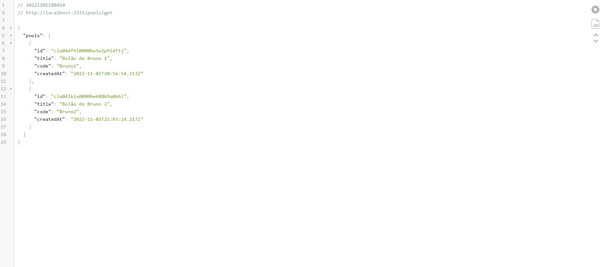

<h1 align="center">
  <span>NLW COPA - SERVER</span>
</h1>

<p align="center">
  <a href="#-projeto">Projeto</a>&nbsp;&nbsp;&nbsp;|&nbsp;&nbsp;&nbsp;
  <a href="#-tecnologias">Tecnologias</a>&nbsp;&nbsp;&nbsp;|&nbsp;&nbsp;&nbsp;
  <a href="#-instalação">Instalação</a>&nbsp;&nbsp;&nbsp;|&nbsp;&nbsp;&nbsp;
  <a href="#memo-licença">Licença</a>
</p>

<br>

<p align="center">
  
</p>

<br>

## 💻 Projeto

Aplicação desenvolvida durante o NLW Copa Ignite promovido pela Rocketseat. Objetivo dessa aplicação é ser o backend que fornece informações sobre os bolões da copa do mundo.

## 🚀 Tecnologias

Esse projeto foi desenvolvido com as seguintes tecnologias:

- [Prisma](https://www.prisma.io/) é um ORM simplifica a modelagem de dados, migrações e acesso a dados para bancos de dados SQL em Node.js e TypeScript.

- [Fastify](https://www.fastify.io/) é um framework web para Node.js com foco em performance ideal para uma arquitetura baseada em microservices.

```
npm i fastify

npm i prisma -D

npm i @prisma/client

npx prisma init --datasource-provider SQLite

npx prisma migrate dev

npx prisma studio

npm i prisma-erd-generator @mermaid-js/mermaid-cli -D

npx prisma generate
```

## 📥 Instalação

Faça um clone desse repositório e acesse o diretório. Em instale todas as dependências com o seguinte comando:

```
npm i
```

Em seguida execute o servidor rodando
```
npm run dev
```


## :memo: Licença

Esse projeto está sob a licença MIT. Veja o arquivo [LICENSE](LICENSE.md) para mais detalhes.

---
**Desenvolvido por [Bruno César](https://github.com/brunocs90).**
